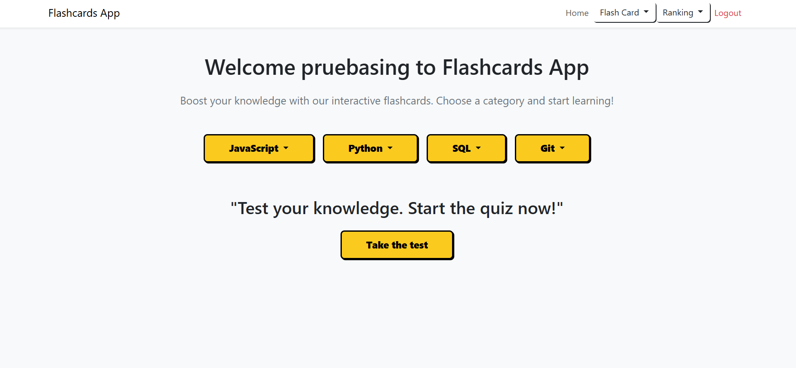

# 📚 Quiz App - Python, JavaScript, SQL, and Git Quizzes

Welcome to the **Quiz App**! This interactive platform helps you practice and improve your knowledge of Python, JavaScript, SQL, and Git. Each level includes challenging questions to enhance your skills.

## 🚀 Main Features

- **Level-Based Quizzes**: Questions are categorized by difficulty levels (Level 1 and Level 2) for each category (Python, JavaScript, SQL, Git).
- **Progress Tracking**: The app saves your score and incorrect answers so you can review them later.
- **User-Friendly Interface**: Intuitive and easy to use.
- **Instant Feedback**: Find out immediately if your answer is correct or incorrect.
- **Detailed Results**: At the end of a quiz, you'll see a summary of your performance.

## 🛠 Technologies Used

- **Backend**: Django (Python)
- **Frontend**: HTML, CSS, Bootstrap, JavaScript
- **Database**: SQLite (default in Django)

## 🏗 How to Set Up the Project

Follow these steps to set up and run the application on your local environment.

### ✅ Prerequisites

- Python 3.8 or higher.
- Pip (Python package manager).
- Git (optional, to clone the repository).

### 🔹 1. Clone the Repository

```bash
 git clone https://github.com/deividmng/quizPy.git
```

### 🔹 2. Create a Virtual Environment (Optional but Recommended)

```bash
 python -m venv env
```

### 🔹 3. Activate the Virtual Environment

#### Windows:
```bash
 env\Scripts\activate
```

#### Mac/Linux:
```bash
 source env/bin/activate
```

### 🔹 4. Install Dependencies

```bash
 pip install -r requirements.txt
```

### 🔹 5. Set Up the Database (if applicable)

If using SQLite (Django default), run the migrations:

```bash
 python manage.py migrate
```

### 🔹 6. Run the Server

```bash
 python manage.py runserver
```
### 🔹 7. If you want to create an administrator user:

```bash
python manage.py createsuperuser
```

The project should now be running at: [http://127.0.0.1:8000/](http://127.0.0.1:8000/).

---

# 📚 What Can You Do with Flashcards?

### 📌 Create Flashcards
Registered users can create flashcards with a question and an answer.

**Example:**
- **Question**: What is a decorator in Python?
- **Answer**: A decorator is a function that modifies the behavior of another function.

### 📌 Edit and Delete Flashcards
If you make a mistake or want to update a flashcard, you can easily edit or delete it.

```bash
# Edit a flashcard
Edit from the user interface

# Delete a flashcard
Delete from the user interface
```

### 📌 Review Your Flashcards
Access your flashcard collection anytime to reinforce your knowledge.

```bash
# Access the flashcards section
Go to the "My Flashcards" menu
```

### 📌 Organize by Categories
Flashcards can be categorized by topics (e.g., Python, JavaScript, SQL, Git).

---

# 🎯 How to Use the Flashcards Feature

### ✅ 1. Register or Log In

```bash
# Register as a new user
Create an account from the user interface

# Log in
Enter credentials from the user interface
```

### ✅ 2. Access the Flashcards Section

```bash
# Navigate to the flashcards menu
Select "My Flashcards" from the navigation menu
```

### ✅ 3. Create a New Flashcard

```bash
# Add a new flashcard
Click "Create Flashcard" and complete the form
```

### ✅ 4. Manage Your Flashcards

```bash
# Edit a flashcard
Select the flashcard and click "Edit"

# Delete a flashcard
Select the flashcard and click "Delete"
```

---

📌 **Enjoy learning with Quiz App!** 🚀
